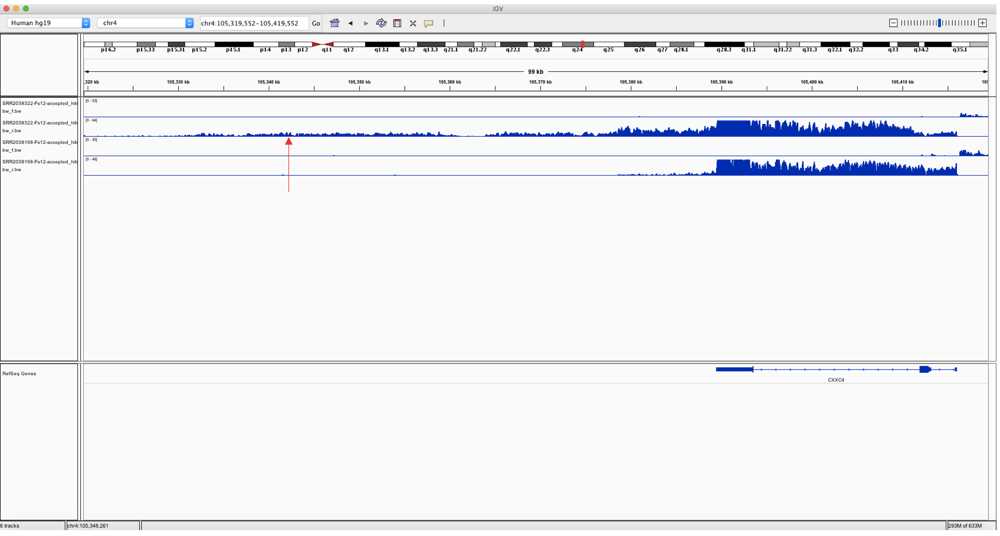
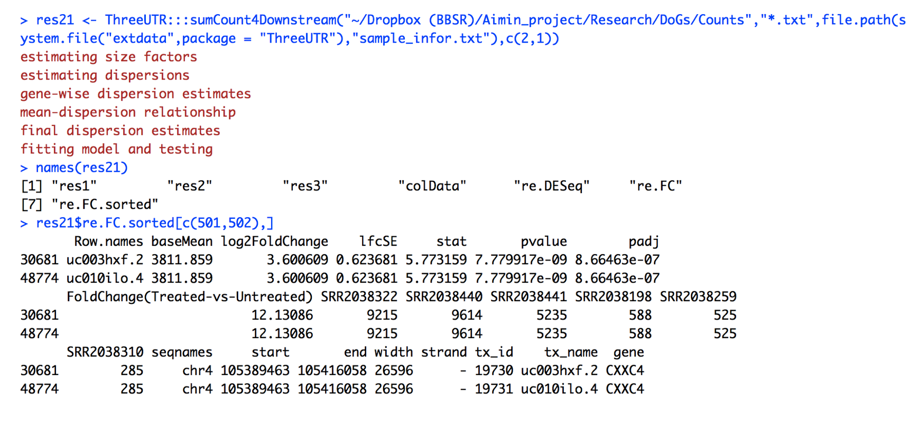

**An pipeline for processing and analyzing DOGs data**

Aimin Yan et al

**Abstract**

Vilborg et al. discovered a new class of long chromatin-associated RNAs, named as a ‘downstream of gene’-containing transcript (DoG). They found that that DoGs is upregulated in response to osmotic stress. Their bioinformatic analysis identified KCl-induced DoGs downstream of more than 10% of all human protein-coding genes. However there is a lack of streamlined bioinforamtics pipleline for processing and analyzing this type of RNA sequence data. This paper aims to develep a pipeline to fill in these gaps for further research on DoGs. 

**Intrduction**

Many transcripts and factors regulating the transcription of other transcripts is still not understood well. Long non-coding RNAs(LncRNAs) is a significant proportion of these pervasive transcription. Vibrorg find that the LncrRNA uc145 is highly induced by osmotic stress and is part of a > 50 kb transcript generated by read-through transcription from the upstream protei-coding gene,CXXC4. They named this new class of long,chromatin-associated transcripts as "DoGs". A DoG consists of a 5' segment corresponding to the upstream gene,referred to as DoGs-associated and a 3' segment specified by the DoG region.  Their bioinformatic analysis shows more than 10% of all human protein-coding genes have KCl-induced DoGs, which suggests a global effect of osmotic stress on transcription downstream of genes. 

Since RNA sequencing data for DoGs identification is new type of data, and the streamlined pipeline for processing and analyzing this type of data is not available yet. So it is ideal to have a pipeline to let biologists perform their analysis on DoGs-related data smoothly. Therefore,  we develop a streamlined pipeline to process and analyze DOGs RNA sequencing data. This pipeline includes aligning short reads on the specified reference genome, collecting intergenic reads, counting number of mapped reads on the downstream of trancsripts, and differentical analysis on DoGs region. The purpose of developing this pipeline is to help biologists to enhance their research on DoGs-related research.  

**Method**

+ Some software you need to install before using this pipeline

    bedtools(http://bedtools.readthedocs.io/en/latest/)
    
    tjparnell's biotoolsbox(https://github.com/tjparnell)

+ To Install

    In R console
```{r}
    library(devtools)

    install_github("SCCC-BBC/DoGs")
```
    Install updated DoGs without restarting R
```{r}
    detach("package:DoGs", unload=TRUE)
    library(DoGs)
```
In pegasus terminal 

    R -e 'library(devtools);install_github("SCCC-BBC/DoGs")'

+ To use DoGs in the batch model

```{r}
R -e 'library(ChipSeq);library(DoGs);DoGs:::runDoGsOnCluster("SRP058633",file.path(system.file("extdata",package = "DoGs"),"sample_infor.txt"),"/projects/ctsi/bbc/Genome_Ref/Homo_sapiens/UCSC/hg19/Annotation/Genes/genes.gtf","/projects/ctsi/bbc/Genome_Ref/Homo_sapiens/UCSC/hg19/Sequence/Bowtie2Index/genome","/projects/ctsi/bbc/aimin/annotation/","/scratch/projects/bbc/aiminy_project/DoGs/TestPipeline",5000)'
```

After finishing this step, you can load strand-specific BigWig to IGV to visualize DoGs. The following is an example to show DoGs


The above Figure shows two samples under two conditions(KCl-treated and untreated). There are 4 panels, the top two panels show the coverage of forward and reverse strand for a sample treated by KCl;the botton two panels show the coverage of forward and reverse strand for an untreated sample. It is clear that we can observe a DoG in the downstream of CXXC4 gene in KCl-treated sample(labeled by red arrow).

+ To run the above steps separately, user can perform the following procedure

```{r}
# Step1: Download RNA sequening short read SRA file

R -e 'library(ChipSeq);library(DoGs);re <- DoGs:::useWget2Download("SRP058633","/nethome/axy148/DoGsExample")'

# Step2: Convert SRA files to fastq files
# If you do not have waited job or run on machine that is not cluster 
R -e 'library(ChipSeq);library(DoGs);re<-DoGs:::useFastqDumpConvertSra2Fastq("/nethome/axy148/DoGsExample","/scratch/projects/bbc/aiminy_project/DoGsFastq")'

# On pegasus, you need to run this if you want to start conversion automatically after downloading using wget
R -e 'library(ChipSeq);library(DoGs);re <- DoGs:::useFastqDumpConvertSra2Fastq("/nethome/axy148/DoGsExample","/scratch/projects/bbc/aiminy_project/DoGsFastq",wait.job.name = "wgetDownload")'

# Step3: Align fastq files to hg19 reference genome

R -e 'library(ChipSeq);library(DoGs);DoGs:::useTophat4Alignment("/scratch/projects/bbc/aiminy_project/DoGsFastq","/scratch/projects/bbc/aiminy_project/DoGs_AlignmentBamTophatGeneral2","/projects/ctsi/bbc/Genome_Ref/Homo_sapiens/UCSC/hg19/Annotation/Genes/genes.gtf","/projects/ctsi/bbc/Genome_Ref/Homo_sapiens/UCSC/hg19/Sequence/Bowtie2Index/genome","General")'

# Step4: 
# Rename accepted_hits.bam based on sample name and move all bam files to another same directory
# Ex:
# rename /scratch/projects/bbc/aiminy_project/DoGs_AlignmentBamTophatGeneral2/SRR2038198/Fs12/accepted_hits.bam to /scratch/projects/bbc/aiminy_project/DoGs/BAM/SRR2038198-Fs12-accepted_hits.bam

R -e 'library(DoGs);DoGs:::processBamFiles('/scratch/projects/bbc/aiminy_project/DoGs_AlignmentBamTophatGeneral2','/scratch/projects/bbc/aiminy_project/DoGs/BAM')'

# Step5: Convert the aligned bam files to strand-specific bigwig files
R -e 'library(ChipSeq);library(DoGs);DoGs:::convertBam2StrandBw2('/scratch/projects/bbc/aiminy_project/DoGs/BAM','/scratch/projects/bbc/aiminy_project/DoGs/BW2')

# Step6: Convert the aligned bam files to bed files

R -e 'library(ChipSeq);library(DoGs);re <- DoGs:::convertbam2bed('/scratch/projects/bbc/aiminy_project/DoGs/BAM','/scratch/projects/bbc/aiminy_project/DoGs')'

# Step7: Remove reads overlappping with exons and intron firstly

R -e 'library(ChipSeq);library(DoGs);DoGs:::removeReadsOnExonIntron("/scratch/projects/bbc/aiminy_project/DoGs/BedFileFromBam","/projects/ctsi/bbc/aimin/annotation/","/scratch/projects/bbc/aiminy_project/DoGs/BedRmExonIntron")'

# Step8: Get counts of intergenic reads with 45kb downstream of transcripts 

R -e 'library(ChipSeq);library(DoGs);DoGs:::getCount4Downstream(""/scratch/projects/bbc/aiminy_project/DoGs/BedRmExonIntron","/projects/ctsi/bbc/aimin/annotation/","/scratch/projects/bbc/aiminy_project/DoGs/Counts45KB")'

# Step9: Convert count files to count table, 
R -e 'library(ChipSeq);library(DoGs);res <- convertCountFile2Table("~/Dropbox (BBSR)/Aimin_project/Research/DoGs/Counts","*.txt")'

# Step10: Perform differential DoGs analysis
# In this step, you need to prepare a sample information file to be used as one of input.
# For the format of this file,you can look up inst/extdata/sample_infor.txt. The first column of this file is sample name, and the second column is group name of all samples belong to

R -e 'library(ChipSeq);library(DoGs);res <- DoGs:::convertCountFile2Table("~/Dropbox (BBSR)/Aimin_project/Research/DoGs/Counts","*.txt");library(org.Hs.eg.db);res.new <- DoGs:::matchAndDE(res,file.path(system.file("extdata",package = "DoGs"),"sample_infor.txt"),group.comparision = c("condition","Untreated","Treated"))'

# We also supply the small aligned Bam files to let users test DoGs piipeine using the following commands

R -e 'library(ChipSeq);library(DoGs);DoGs:::runDoGsOnClusterStartFromBam(file.path(system.file("extdata",package = "DoGs"),"sample_infor.txt"),"/projects/ctsi/bbc/Genome_Ref/Homo_sapiens/UCSC/hg19/Annotation/Genes/genes.gtf","/projects/ctsi/bbc/Genome_Ref/Homo_sapiens/UCSC/hg19/Sequence/Bowtie2Index/genome","/projects/ctsi/bbc/aimin/annotation/","/scratch/projects/bbc/aiminy_project/DoGs/Example")'

```
The following Figure shows differentila DoGs analysis results for two transcripts for CXXC4(shown on the above Figure) under two conditions(KCl-treated and untreated). It is clear that there are differential DoGs in the downstream of CXXC4 gene between two conditions, which is consistent with the above visualization


**Summary**

Vilborg identifyied a new class of long chromatin-associated RNA,named as DoGs. RNA sequencing data for discoverying DoGs is a new type of data, and the streamlined bioinformatics pipeline for processing and analyzing this new type of RNA sequencing data is not available yet. Here we developed a streamlined pipeline to proceesing DoGs RNA-Seq data. We believe that this bioinformatics pipeline can enhance the research related to DoGs.
